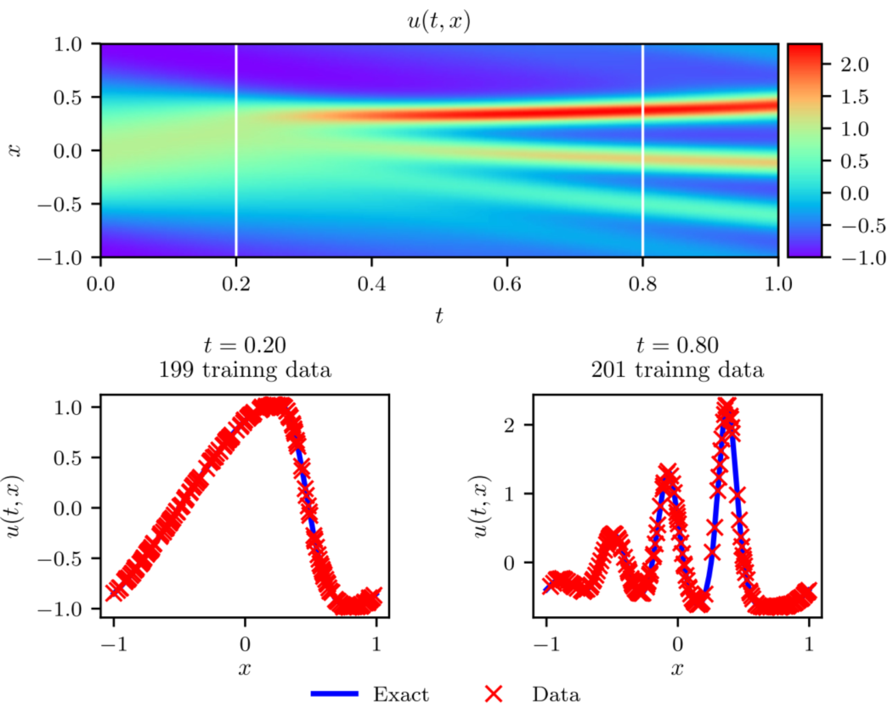

## Author

[Bhavesh Shrimali](https://bhaveshshrimali.github.io/)

## Introduction

This blog covers [Physics Informed Neural Networks](https://www.sciencedirect.com/science/article/pii/S0021999118307125), which are basically neural networks that are constrained to obey physical constraints. The blog broadly discusses two directions:

* [Data-driven solutions of PDEs](https://arxiv.org/abs/1711.10561)
* [Data-driven discovery of PDEs](https://arxiv.org/abs/1711.10566)

In particular, it deals with two distinct types of algorithms, namely

* A new family of data-efficient spatio-temporal function approximators
* Arbitrary accurate RK time steppers with potentially unlimited number of stages

We know that deep neural networks are powerful function approximators. They can approximate a nonlinear map from a few -- potentially very high dimensional -- input and output pairs of data. However, the approximation does not take into account any underlying physical constraints imposed by fundamental principles (such as conservation laws) which are
often given in terms of PDEs. PINNs precisely solve this problem by regularizing the loss functions with these constraints. The resulting approximation enjoys both the power of deep neural nets as function approximators and obeying the underlying physical conservation laws.

* * * * * *

## PDEs

Let us consider a parametric nonlinear PDE

$$
    \color{BrickRed} u_{t}+\mathcal{N}[u ; \lambda]=0, x \in \Omega \subset \mathbb{R}^D,\, t \in[0, T];\quad ({\cdot})_t := \frac{\partial ({\cdot})}{\partial t}
$$
where $u(t, x)$ denotes the latent (hidden) solution and $\mathcal{N}[\cdot ; \lambda]$ is a nonlinear operator parametrized by $\lambda$. This encapsulation covers a wide range of PDEs in math, physics, atmospheric sciences, biology, finance, including conservation laws, diffusion, reac-diff-advec. PDEs, kinetics etc. The burger's equation in $2$d is an apt starting step to investigate if indeed PINNs can efficiently solve PDEs, and therefore the authors begin by applying PINNs to it.

$$
    \mathcal{N}[u ; \lambda]=\lambda_{1} u u_{x}-\lambda_{2} u_{x x} \text { and } \lambda=\left(\lambda_{1}, \lambda_{2}\right);\quad ({\cdot})_x := \frac{\partial ({\cdot})}{\partial x}
    \quad ({\cdot})_{xx} := \frac{\partial^2 ({\cdot})}{\partial x^2}
$$

The two directions highlighted above can now be restated in context of Burger's equation as follows:

* Given $\lambda$ what is $u(t, x)$ (data-driven solutions of PDEs)
* Find $\lambda$ that best describes observations $u({t_i, x_j})$ (data-driven discovery of PDEs)

* * * * * *

## PDEs + PINNs

First, let us rewrite the PDE as $f(u; t,x) = 0$
$$
    f(u; t,x) \doteq u_{t}+\mathcal{N}[u], \quad \text{along with}\quad u = u_\theta ({t, x})
$$

The next step consists of appending the loss function used for the training process (finding the parameters $\theta$) as follows:

$$
    \mathcal{L}=\mathcal{L}_{u}+\mathcal{L}_{f}
$$

where

$$
    \mathcal{L}_{u}=\frac{1}{N_{u}} \sum_{i=1}^{N_{u}}\left|u\left(t_{u}^{i}, x_{u}^{i}\right)-u^{i}\right|^{2}\, ;\quad \mathcal{L}_{f}=\frac{1}{N_{f}} \sum_{i=1}^{N_{f}}\left|f\left(t_{f}^{i}, x_{f}^{i}\right)\right|^{2}.
$$

Here $\mathcal{L}_{u}$ consists of the approximation error at the boundary of the domain (initial and boundary conditions), and $\mathcal{L}_{f}$ denotes the error incurred inside the domain. Also, $\left\{t_{f}^{i}, x_{f}^{i}\right\}_{i=1}^{N_{f}}$ specify the collocation points --- the discrete points at which the physical constraints are imposed through a regularized (penalty) formulation. Another way to look at this is that $\mathcal{L}_u$ helps to enforce initial and boundary data accurately, while $\mathcal{L}_f$ imposes the structure of the PDE into the training process.

* * * * * *

## Implementation details and Code

Since most of the examples considered here involve a small number of training data points, the authors choose to exploit quasi-second order optimization methods such as L-BFGS. They do not consider mini-batching for the same reason and consider the full batch on the update. There are no theoretical guarantees on the existence of the minimizer but the authors observe empirically that as long as the PDE is well-posed the optimization algorithm converges to the correct solution.

The original implementation can be accessed at <https://github.com/maziarraissi/PINNs> which builds on top of Tensorflow. Corresponding PyTorch and Julia (Flux) implementations can be accessed at <https://github.com/idrl-lab/idrlnet> and <https://neuralpde.sciml.ai/dev/>

* * * * * *

## Examples: Schrodinger Equation

As a first example, consider a complex-valued differential equation ($h(t, x) = u(t, x) + \mathrm{i}\, v(t,x)$), namely the Schrodinger equation,

$$
    \begin{aligned}
        f\doteq \, &i h_{t}+0.5 h_{x x}+|h|^{2} h=0, \quad x \in[-5,5], \quad t \in[0, \pi / 2] \\
        &h(0, x)=2 \operatorname{sech}(x) \\
        &h(t,-5)=h(t, 5) \\
        &h_{x}(t,-5)=h_{x}(t, 5)
    \end{aligned}
$$

In order to generate the training data, the authors employ a classical pseudo-spectral solver in space ($x$) coupled with a high-order RK time stepper.
The results are shown in the figure below (Fig. 1 in the paper). PINN provides an accurate solution to Schrodinger equation and can handle periodic boundary conditions, nonlinearities and complex valued nature of the PDE efficiently.

<!--  -->

Although PINN provides a good approximation to the solution above, training the network requires a large number of data points. This is where the adaptive time-stepping using RK methods comes into the picture. The authors propose an adaptive time-stepping with a neural net at each time-step. This significantly improves the approximation quality, and allows one to take much larger time-steps compared to traditional solvers.

* * * * * *
## Examples: Allen-Cahn Equation

In order to test the adaptive time-stepping scheme, the authors next take a look at the Allen-Cahn equation.

$$
    \begin{aligned}
        &u_{t}-0.0001 u_{x x}+5 u^{3}-5 u=0, \quad x \in[-1,1], \quad t \in[0,1], \\
        &u(0, x)=x^{2} \cos (\pi x), \\
        &u(t,-1)=u(t, 1), \\
        &u_{x}(t,-1)=u_{x}(t, 1) .
    \end{aligned}
$$

The results show excellent agreement between the predicted and exact (numerical) solutions. The only difference here is that the authors consider the sum-of-squared errors as the loss function for training, instead of the MSE used before, i.e.

$$
      S S E_{n}=\sum_{j=1}^{q+1} \sum_{i=1}^{N_{n}}\left|u_{j}^{n}\left(x^{n, i}\right)-u^{n, i}\right|^{2}
$$
$$
    \begin{aligned}
    S S E_{b}
    &=
    \sum_{i=1}^{q}\left|u^{n+c_{i}}(-1)-u^{n+c_{i}}(1)\right|^{2}+\left|u^{n+1}(-1)-u^{n+1}(1)\right|^{2} \\
    &+
    \sum_{i=1}^{q}\left|u_{x}^{n+c_{i}}(-1)-u_{x}^{n+c_{i}}(1)\right|^{2}+\left|u_{x}^{n+1}(-1)-u_{x}^{n+1}(1)\right|^{2}
    \end{aligned}
$$

* * * * * *
## Examples: Navier-Stokes Equation

In this section, we take a look at how data-driven discovery of PDEs can be carried out using PINNs. Consider the NS equations in 2-dimensions,

$$
    \begin{aligned}
        &u_{t}+\lambda_{1}\left(u u_{x}+v u_{y}\right)=-p_{x}+\lambda_{2}\left(u_{x x}+u_{y y}\right) \\
        &v_{t}+\lambda_{1}\left(u v_{x}+v v_{y}\right)=-p_{y}+\lambda_{2}\left(v_{x x}+v_{y y}\right)
    \end{aligned};
    \quad \text{where}\quad ({\cdot})_x = \frac{\partial({\cdot})}{\partial x}.
$$

* Here $u(t, x, y)$ denotes the $x$-component of the velocity, $v(t, x, y)$ denotes the $y$ component and $p(t, x, y)$ the pressure field.
* Conservation of mass requires $u_{x}+v_{y}=0 \implies$ $u=\psi_{y}, \quad v=-\psi_{x}$
* Given a set of observations: $\left\{t^{i}, x^{i}, y^{i}, u^{i}, v^{i}\right\}_{i=1}^{N}$
$$
    \begin{aligned}
        &f \doteq u_{t}+\lambda_{1}\left(u u_{x}+v u_{y}\right)+p_{x}-\lambda_{2}\left(u_{x x}+u_{y y}\right) \\
        &g \doteq v_{t}+\lambda_{1}\left(u v_{x}+v v_{y}\right)+p_{y}-\lambda_{2}\left(v_{x x}+v_{y y}\right)
    \end{aligned}
$$
* The goal then is to learn $\lambda = \{\lambda_1, \lambda_2\}$, and pressure field $p(t, x, y)$ by jointly approximating $[\psi(t, x, y) \quad p(t, x, y)]$ with a single NN with two outputs. The total loss function is given by

$$
\begin{aligned}  
    \mathcal{L}
    &\doteq
    \frac{1}{N} \sum_{i=1}^{N}\left(\left|u\left(t^{i}, x^{i}, y^{i}\right)-u^{i}\right|^{2}+\left|v\left(t^{i}, x^{i}, y^{i}\right)-v^{i}\right|^{2}\right) \\
    &+
    \frac{1}{N} \sum_{i=1}^{N}\left(\left|f\left(t^{i}, x^{i}, y^{i}\right)\right|^{2}+\left|g\left(t^{i}, x^{i}, y^{i}\right)\right|^{2}\right)
\end{aligned}
$$

The training is carried out using a spectral solver NekTar and then randomly sampling points out of the grid for collocation. The figure on the bottom shows the locations of the training data-points.

PINN is able to successfully predict the pressure field with just $1\%$ of the available data as collocation points as shown below (and also able to learn the parameters $\lambda_j$ in the process)

* * * * * *
## Examples: KDv Equation

As a final example illustrating data-driven discovery of PDEs, the authors choose an equation with higher order derivatives, namely the Korteweg-de Vries equation, that is encountered in the modeling of shallow water waves,

$$
    u_{t}+\lambda_{1} u u_{x}+\lambda_{2} u_{x x x}=0
$$

The problem is to learn the parameters in a similar fashion as done for Navier-Stokes Equation

$$
    \mathcal{N}\left[u^{n+c_{j}}\right]=\lambda_{1} u^{n+c_{j}} u_{x}^{n+c_{j}}-\lambda_{2} u_{x x x}^{n+c_{j}}
$$

PINN again is able to learn the parameters to the desired accuracy and provide an accurate resolution of the dynamics of the system.

* * * * * *
## Conclusion

The major take-away of the paper can be summarized in the following concluding remarks.

* The authors introduced PINNs, a new class of universal function approximators that are capable of encoding any underlying physical laws that govern a given data-set (described by PDEs)
* They also prove a Design for data-driven algorithms that can be used for inferring solutions to general nonlinear PDEs, and constructing computationally efficient physics-informed surrogate models.
  
They also rightly point to some lingering questions that still remain unanswered in the original paper:

* How deep/wide should the neural network be ? How much data is really needed ?
* Why does the algorithm converge to unique values for the parameters of the differential operators, i.e., why is the algorithm not suffering from local optima for the parameters of the differential operator?
* Does the network suffer from vanishing gradients for deeper architectures and higher order differential operators? Could this be mitigated by using different activation functions?
* Can we improve on initializing the network weights or normalizing the data? How about the choices for the loss function choices (MSE, SSE)? What about the robustness of these networks especially when applied to solve chaotic PDEs/ODEs? 

* * * * * *
## Citation

    @article{raissi2019physics,
    title={Physics-informed neural networks: A deep learning framework for solving forward and inverse problems involving nonlinear partial differential equations},
    author={Raissi, Maziar and Perdikaris, Paris and Karniadakis, George E},
    journal={Journal of Computational Physics},
    volume={378},
    pages={686--707},
    year={2019},
    publisher={Elsevier}

    @article{raissi2017physicsI,
    title={Physics Informed Deep Learning (Part I): Data-driven Solutions of Nonlinear Partial Differential Equations},
    author={Raissi, Maziar and Perdikaris, Paris and Karniadakis, George Em},
    journal={arXiv preprint arXiv:1711.10561},
    year={2017}

    @article{raissi2017physicsII,
    title={Physics Informed Deep Learning (Part II): Data-driven Discovery of Nonlinear Partial Differential Equations},
    author={Raissi, Maziar and Perdikaris, Paris and Karniadakis, George Em},
    journal={arXiv preprint arXiv:1711.10566},
    year={2017}
